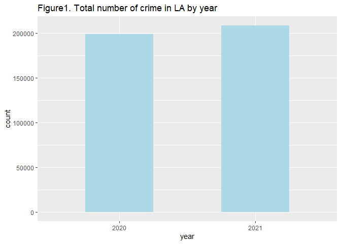
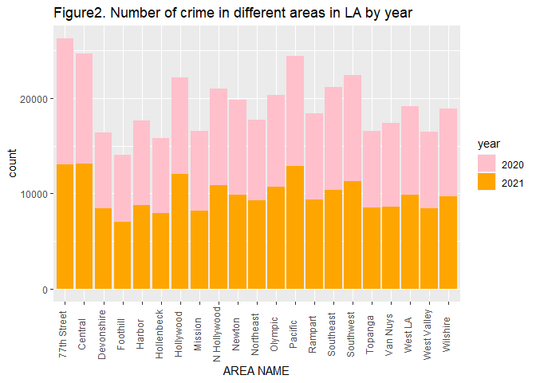
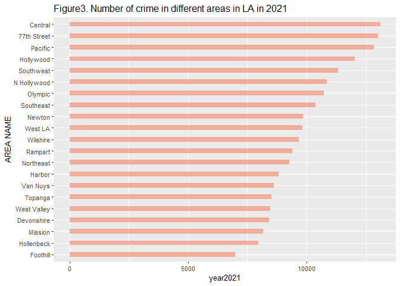
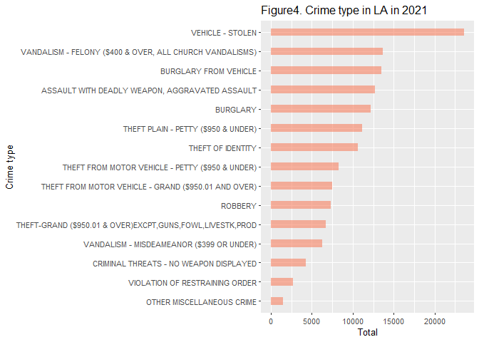
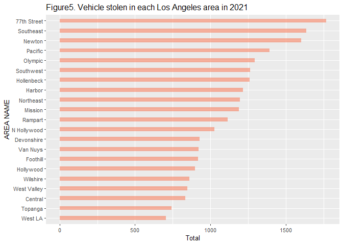
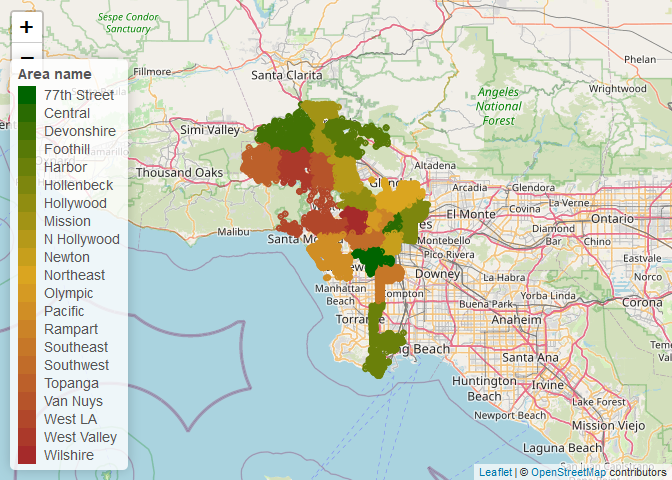

Midterm Project
================
Yuwei Wu
2022-10-22

# Introduction

Almost every week I will receive Crime Alerts from the USC Department of
Public Safety, so I’m interested to know the crime incidence and
distribution in LA. This dataset reflects incidents of crime in the City
of Los Angeles dating back to 2020. It’s provided by the Los Angeles
Police Department.

-   The primary question is whether the number of crime has decreased in
    LA from 2020 to 2021.

-   The sub-question:

    Which area of Los Angeles has the highest number of crime in 2021?

    What is the most common crime type in 2021 and which area occurred
    most?

# Methods

## Data source

This dataset is obtained from the Los Angeles Open Data website
(<https://data.lacity.org/Public-Safety/Crime-Data-from-2020-to-Present/2nrs-mtv8>).

## Data cleaning and wrangling

This original dataset collected data on crimes from January 1st, 2020 to
October 10th, 2022. After reading in data, checking the dimensions,
headers, and footers, and carefully checking for variable names and
types. There are 581764 rows and 29 variables and no missing value in
the key variables. There are 137 different crime and 21 areas in LA in
the dataset. Transformed the character to date and extract the year from
the occurrence date then created a variable called ‘year’, which refers
to the year in which the crime occurred. For subsequent analysis,
extracting data in 2020 and 2021 to a new dataset, and formed a
sub-dataset that only includes data in 2020 and a sub-dataset that only
includes data in 2021.

``` r
#Read in data
crime <- data.table::fread("Crime_Data_from_2020_to_Present.csv")
```

``` r
#Check the dimensions, headers, footers
dim(crime)
head(crime)
tail(crime)
#Take a look at the variables
str(crime)
#Take a closer look at the key variables
table(crime$`DATE OCC`)
table(crime$`Crm Cd Desc`)
table(crime$`AREA NAME`)
distinct(crime, `Crm Cd Desc`)
distinct(crime, `AREA NAME`)
#Check missing values
summary(is.na(crime))
#Transform character to date and extract the year from the occurrence date then add a new column named "year"
dates <- as.POSIXct(crime$`DATE OCC`, format = "%m/%d/%Y %H:%M:%S AM")
crime$year <- format(dates, format="%Y")
#Extract data in 2020 and 2021
data_all <- crime[year == "2020" | year == "2021"]
data2020 <- crime[year == "2020"]
data2021 <- crime[year == "2021"]
```

## Data exploration

I created summary tables of descriptive analysis by summarized
statistics of the variables that this project concerned about. Then I
used bar charts to compare the total number of crime, and the number of
crime in different areas in 2020 and 2021. I also used bar chart to show
crime in each Los Angeles area in 2021, then used bar chart to show the
top15 crime type in Los Angeles. I also generated a bar chart to show
the number of vehicle stolen that occurred in each Los Angeles area, as
well as a leaflet map shows the detailed locations of the vehicle stolen
occurred.

# Preliminary Results

## Summary tables of descriptive analysis:

``` r
crime_year <- data_all[, .(
  "Total number of crime" =  .N
), by = `year` ]
knitr::kable(crime_year, col.names = c("Year","Total number of crime"), caption = "Table1. Total number of crime in LA")%>%
kable_styling(bootstrap_options = c("striped", "hover"), full_width = F)
```

<table class="table table-striped table-hover" style="width: auto !important; margin-left: auto; margin-right: auto;">
<caption>
Table1. Total number of crime in LA
</caption>
<thead>
<tr>
<th style="text-align:left;">
Year
</th>
<th style="text-align:right;">
Total number of crime
</th>
</tr>
</thead>
<tbody>
<tr>
<td style="text-align:left;">
2020
</td>
<td style="text-align:right;">
198644
</td>
</tr>
<tr>
<td style="text-align:left;">
2021
</td>
<td style="text-align:right;">
208294
</td>
</tr>
</tbody>
</table>

Table1 shows that there are 198644 crime in 2020 and 208294 crime in
2021 in Los Angeles. More total number of crime in 2021 than in 2020.

``` r
crime_2020 <- data2020[, .(
  "year2020" =  .N
), by = "AREA NAME"]

crime_2021 <- data2021[, .(
  "year2021" =  .N
), by = "AREA NAME"]

crime_data <- data_all[, .(
  "Total" =  .N
), by = "AREA NAME"]

#combine two dataframe
crime_combined1 = merge(crime_2020, crime_2021, by="AREA NAME", all.x=T)

crime_combined2 = merge(crime_combined1, crime_data, by="AREA NAME", all.x=T)

knitr::kable(crime_combined2,col.names = c("Area Name","2020","2021", "Total"), caption = "Table2. Number of crime in different areas in LA")%>% 
add_header_above(c(" " = 1, "Year" = 2, " " = 1 ))%>%
kable_styling(bootstrap_options = c("striped", "hover"), full_width = F)
```

<table class="table table-striped table-hover" style="width: auto !important; margin-left: auto; margin-right: auto;">
<caption>
Table2. Number of crime in different areas in LA
</caption>
<thead>
<tr>
<th style="empty-cells: hide;border-bottom:hidden;" colspan="1">
</th>
<th style="border-bottom:hidden;padding-bottom:0; padding-left:3px;padding-right:3px;text-align: center; " colspan="2">

<div style="border-bottom: 1px solid #ddd; padding-bottom: 5px; ">

Year

</div>

</th>
<th style="empty-cells: hide;border-bottom:hidden;" colspan="1">
</th>
</tr>
<tr>
<th style="text-align:left;">
Area Name
</th>
<th style="text-align:right;">
2020
</th>
<th style="text-align:right;">
2021
</th>
<th style="text-align:right;">
Total
</th>
</tr>
</thead>
<tbody>
<tr>
<td style="text-align:left;">
77th Street
</td>
<td style="text-align:right;">
13232
</td>
<td style="text-align:right;">
13011
</td>
<td style="text-align:right;">
26243
</td>
</tr>
<tr>
<td style="text-align:left;">
Central
</td>
<td style="text-align:right;">
11558
</td>
<td style="text-align:right;">
13108
</td>
<td style="text-align:right;">
24666
</td>
</tr>
<tr>
<td style="text-align:left;">
Devonshire
</td>
<td style="text-align:right;">
7920
</td>
<td style="text-align:right;">
8421
</td>
<td style="text-align:right;">
16341
</td>
</tr>
<tr>
<td style="text-align:left;">
Foothill
</td>
<td style="text-align:right;">
7065
</td>
<td style="text-align:right;">
6991
</td>
<td style="text-align:right;">
14056
</td>
</tr>
<tr>
<td style="text-align:left;">
Harbor
</td>
<td style="text-align:right;">
8831
</td>
<td style="text-align:right;">
8816
</td>
<td style="text-align:right;">
17647
</td>
</tr>
<tr>
<td style="text-align:left;">
Hollenbeck
</td>
<td style="text-align:right;">
7780
</td>
<td style="text-align:right;">
7978
</td>
<td style="text-align:right;">
15758
</td>
</tr>
<tr>
<td style="text-align:left;">
Hollywood
</td>
<td style="text-align:right;">
10110
</td>
<td style="text-align:right;">
12025
</td>
<td style="text-align:right;">
22135
</td>
</tr>
<tr>
<td style="text-align:left;">
Mission
</td>
<td style="text-align:right;">
8420
</td>
<td style="text-align:right;">
8163
</td>
<td style="text-align:right;">
16583
</td>
</tr>
<tr>
<td style="text-align:left;">
N Hollywood
</td>
<td style="text-align:right;">
10106
</td>
<td style="text-align:right;">
10849
</td>
<td style="text-align:right;">
20955
</td>
</tr>
<tr>
<td style="text-align:left;">
Newton
</td>
<td style="text-align:right;">
9929
</td>
<td style="text-align:right;">
9855
</td>
<td style="text-align:right;">
19784
</td>
</tr>
<tr>
<td style="text-align:left;">
Northeast
</td>
<td style="text-align:right;">
8416
</td>
<td style="text-align:right;">
9285
</td>
<td style="text-align:right;">
17701
</td>
</tr>
<tr>
<td style="text-align:left;">
Olympic
</td>
<td style="text-align:right;">
9587
</td>
<td style="text-align:right;">
10741
</td>
<td style="text-align:right;">
20328
</td>
</tr>
<tr>
<td style="text-align:left;">
Pacific
</td>
<td style="text-align:right;">
11529
</td>
<td style="text-align:right;">
12837
</td>
<td style="text-align:right;">
24366
</td>
</tr>
<tr>
<td style="text-align:left;">
Rampart
</td>
<td style="text-align:right;">
8975
</td>
<td style="text-align:right;">
9396
</td>
<td style="text-align:right;">
18371
</td>
</tr>
<tr>
<td style="text-align:left;">
Southeast
</td>
<td style="text-align:right;">
10776
</td>
<td style="text-align:right;">
10375
</td>
<td style="text-align:right;">
21151
</td>
</tr>
<tr>
<td style="text-align:left;">
Southwest
</td>
<td style="text-align:right;">
11107
</td>
<td style="text-align:right;">
11324
</td>
<td style="text-align:right;">
22431
</td>
</tr>
<tr>
<td style="text-align:left;">
Topanga
</td>
<td style="text-align:right;">
8047
</td>
<td style="text-align:right;">
8509
</td>
<td style="text-align:right;">
16556
</td>
</tr>
<tr>
<td style="text-align:left;">
Van Nuys
</td>
<td style="text-align:right;">
8716
</td>
<td style="text-align:right;">
8632
</td>
<td style="text-align:right;">
17348
</td>
</tr>
<tr>
<td style="text-align:left;">
West LA
</td>
<td style="text-align:right;">
9266
</td>
<td style="text-align:right;">
9838
</td>
<td style="text-align:right;">
19104
</td>
</tr>
<tr>
<td style="text-align:left;">
West Valley
</td>
<td style="text-align:right;">
8033
</td>
<td style="text-align:right;">
8467
</td>
<td style="text-align:right;">
16500
</td>
</tr>
<tr>
<td style="text-align:left;">
Wilshire
</td>
<td style="text-align:right;">
9241
</td>
<td style="text-align:right;">
9673
</td>
<td style="text-align:right;">
18914
</td>
</tr>
</tbody>
</table>

Table2 shows that there are 21 areas occured crime and the number of
crime in different areas in LA are close in 2020 and in 2021. Total
number of crime in all areas had more than 14000 in 2020 and 2021, with
77th Street has the highest crime rate at 26243 and the Foothills has
the lowest crime rate at 14056.

## Plots

1.  Used barchart to show crime in LA by year.

``` r
ggplot(data_all, aes(x =year)) + 
  geom_bar(stat = 'count', fill = 'lightblue',width = 0.5) + 
  labs(title = "Figure1. Total number of crime in LA by year")
```

<!-- -->

Figure1 shows the total number of crime in 2021 more than in 2020 but
the difference is small.

2.  Used barchart to show crime in different areas in LA by year.

``` r
ggplot(data_all, mapping = aes(x = `AREA NAME`), fill = year) + 
  geom_bar(aes(fill = year)) + 
  scale_fill_manual(values = c("pink","orange"))+
  theme(axis.text.x = element_text(angle = 90, hjust = 0.5, vjust = 0.1))+
  labs(title = "Figure2. Number of crime in different areas in LA by year", x = "AREA NAME")
```

<!-- -->

Figure2 shows the number of crime in different areas in LA are close in
2020 and in 2021. 77th Street, Central and Pacific are the three most
dangerous areas.

3.  Used barchart to show crime in different area in LA in 2021.

``` r
df<-as.data.frame(crime_2021)
df %>%
  mutate(`AREA NAME` = fct_reorder(`AREA NAME`, `year2021`)) %>%
  ggplot(aes(x=`AREA NAME`, y=`year2021`)) +
    geom_bar(stat="identity", fill="#f68060", alpha=.6, width=.4) +
    theme(axis.text.x = element_text(hjust = 0.5, vjust = 0.1))+
    labs(title = "Figure3. Number of crime in different areas in LA in 2021")+    
    theme_gray(base_size = 10)+
    coord_flip()
```

<!-- -->

Figure3 shows that 77th Street, Central, and Pacific are the three most
dangerous areas that have the highest crime in 2021.

4.  Used barchart to show the top 15 crime type in LA in 2021.

``` r
data2021_crime <- data2021[,.(
  Total =  .N
),by=c("Crm Cd Desc")]

df1<-as.data.frame(data2021_crime)
df1 %>%
  mutate(`Crime type` = fct_reorder(`Crm Cd Desc`, Total)) %>%    
  head(15)%>% 
  ggplot(aes(x=`Crime type`, y=Total)) +
    geom_bar(stat="identity", fill="#f68060", alpha=.6, width=.4) +
    theme(axis.text.x = element_text(hjust = 0.5, vjust = 0.1))+
    labs(title = "Figure4. Crime type in LA in 2021")+
    theme_gray(base_size = 10)+
    coord_flip()
```

<!-- -->

Figure4 shows that the most common crime type is vehicle stolen in 2021.

5.  Used barchart to show the number of vehicle stolen occurred in
    different areas in 2021.

``` r
vs <- data2021[`Crm Cd` == "510"]
vs1 <- vs[(LAT!=0)|(LON!=0)][, .(
  "Total" =  .N
), by = "AREA NAME"]

df2<-as.data.frame(vs1)
df2 %>%
  mutate(`AREA NAME` = fct_reorder(`AREA NAME`, Total)) %>%    
  ggplot(aes(x=`AREA NAME`, y=Total)) +
    geom_bar(stat="identity", fill="#f68060", alpha=.6, width=.4) +
    theme(axis.text.x = element_text(hjust = 0.5, vjust = 0.1))+
    labs(title = "Figure5. Vehicle stolen in each Los Angeles area in 2021")+
    theme_gray(base_size = 10)+
    coord_flip()
```

<!-- -->

Figure5 shows that the most vehicle stolen occurred on 77th Street in
2021.

6.  Used leaflet map to visually show the detail locations of the
    vehicle stolen occurred in 2021.

``` r
vs.pal <- colorFactor(c('darkgreen','goldenrod', 'brown'), domain=vs$`AREA NAME`)

map <- leaflet(vs[(LAT!=0)|(LON!=0)]) %>% 
  # The looks of the Map
  addProviderTiles('OpenStreetMap') %>% 
  # Some circles
  addCircles(
    lat = ~LAT, lng=~LON, 
  # HERE IS OUR PAL!
    color = ~ vs.pal(`AREA NAME`),
    opacity = 1, fillOpacity = 1, radius = 0.01
    ) %>%
  # And a pretty legend
    addLegend('bottomleft', pal=vs.pal, values=vs$`AREA NAME`, title='Area name', opacity=1)
map
```

<!-- -->

# Conclusion

From 2020 to 2021, although the number of crime in 21 different areas in
Los Angeles has not changed obviously, overall, the crime in Los Angeles
has not decreased but increased. In 2021, 77th Street, Central, and
Pacific of Los Angeles have the most crime occurred, and so do 2020. In
2021, the most common crime type is vehicle stolen which most occurred
on 77th Street.
